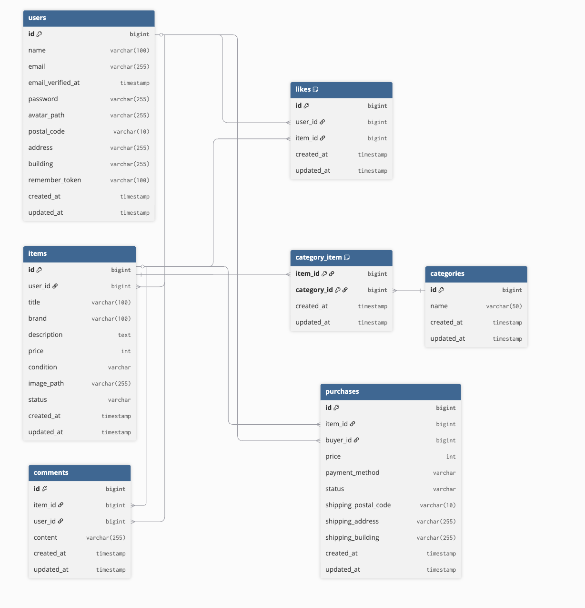

# coachtech-furima
フリマアプリ

## 環境構築
**Dockerビルド**
1. `git clone https://github.com/otaketaro/coachtech-furima`
2. Docker Desktop を起動
3. `docker-compose up -d --build`

**Laravel環境構築**
1. `docker-compose exec php bash`
2. `composer install`
3. 「.env.example」ファイルを コピーして「.env」を作成
    cp .env.example .env

4. .env の DB 設定を以下に変更
``` text
DB_HOST=mysql
DB_DATABASE=laravel_db
DB_USERNAME=laravel_user
DB_PASSWORD=laravel_pass
```
5. アプリケーションキーの作成
``` bash
php artisan key:generate
```

6. マイグレーションの実行
``` bash
php artisan migrate
```

7. シーディングの実行
``` bash
php artisan db:seed
```

## 使用技術
1. Laravel Framework 8.83.8
2. PHP 8.1.33
3. nginx 1.21.1
4. MySQL 8.0.26
5. Docker 28.0.1


## ER図




## 管理者ログイン情報
- メールアドレス: admin@example.com
- パスワード: password123

## 一般ユーザーログイン情報
- メールアドレス: buyer1@example.com
- パスワード: password123


## URL
- 開発環境：http://localhost
- phpMyAdmin：http://localhost:8080


## テストについて

1) テスト DB 作成（初回のみ・ホスト側）


docker compose exec mysql mysql -uroot -proot -e \
"CREATE DATABASE IF NOT EXISTS laravel_db_test CHARACTER SET utf8mb4 COLLATE utf8mb4_unicode_ci;
 GRANT ALL PRIVILEGES ON laravel_db_test.* TO 'laravel_user'@'%';
 FLUSH PRIVILEGES;"


2) .env.testing 用意（PHP コンテナ内）


cp .env.testing.example .env.testing


※ .env.testing.example を同梱しています。APP_KEY の設定は phpunit.xml 側で注入済みのため、.env.testing 側はそのままで問題ありません。

3) testing 環境でマイグレーション / シーディング


php artisan config:clear
php artisan migrate --env=testing
php artisan db:seed --env=testing

4) テスト実行


php artisan test


## 補足
商品詳細ページのエラーメッセージの指定がなかったため、「リスト内の項目を選択してください」というエラーメッセージが出るようにしてあります。